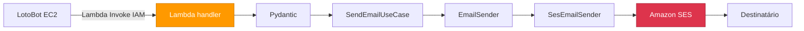

# Mail Sender AWS

<div align="center">


</div>

<div align="center">
  <p><strong>API serverless para envio de e-mails pelo Amazon SES</strong></p>
  <p>
    <a href="#visão-geral">Visão Geral</a> •
    <a href="#arquitetura">Arquitetura</a> •
    <a href="#pré-requisitos">Pré-requisitos</a> •
    <a href="#quickstart">Quickstart</a> •
    <a href="#api">API</a> •
    <a href="#deploy">Deploy</a> •
    <a href="#testes">Testes</a>
  </p>
</div>

> O Mail Sender AWS recebe invocações diretas da EC2 do LotoBot, valida o payload na Lambda e envia o e-mail pelo Amazon SES.

> [!CAUTION]
> O template não publica API Gateway ou Function URL. A role do LotoBot recebe `lambda:InvokeFunction` somente no ARN da função.

## Visão Geral

Este projeto é a versão serverless do `mail-sender`. Ele usa um Lambda handler puro, sem FastAPI ou Uvicorn, para manter o pacote pequeno e reduzir a sobrecarga de inicialização.

### Principais características

- **Serverless**: AWS Lambda invocada diretamente por IAM, sem API Gateway.
- **Envio gerenciado**: integração com Amazon SES API v2 por meio do `boto3`.
- **Validação de entrada**: payload validado com Pydantic.
- **Clean Architecture**: domínio, caso de uso, handler e infraestrutura separados.
- **Infraestrutura como código**: recursos definidos em AWS SAM.
- **Testes isolados**: fakes substituem o SES; os testes não enviam e-mails reais.
- **Logs controlados**: retenção de sete dias no CloudWatch Logs.

## Arquitetura



### Estrutura do projeto

```text
mail-sender-aws/
├── src/
│   ├── api/                         # Schemas de entrada e saída
│   ├── application/                 # Caso de uso de envio
│   ├── domain/                      # Entidades, porta e exceções
│   ├── infrastructure/              # Integração com Amazon SES
│   ├── lambda_handler.py            # Entrada da invocação direta
│   └── requirements.txt             # Dependências empacotadas pelo SAM
├── tests/                            # Testes unitários
├── docs/                             # Guias da migração para AWS (Windows e Linux)
├── pyproject.toml                    # Projeto e dependências de desenvolvimento
├── samconfig.local.toml              # Modelo de configuração do deploy
└── template.yaml                     # Infraestrutura AWS SAM
```

## Pré-requisitos

| Requisito | Versão/condição | Descrição |
|---|---:|---|
| Python | 3.12+ | Runtime e testes locais |
| AWS CLI | v2 | Autenticação e operações na conta AWS |
| AWS SAM CLI | Atual | Build, execução local e deploy |
| Docker Desktop | Em execução | Obrigatório para `sam local` |
| Amazon SES | Identidade verificada | Remetente usado pela Lambda |
| Credenciais AWS | Perfil configurado | Permissão para CloudFormation, Lambda, IAM, Logs e SES |

## Quickstart

### Ambiente Python

```powershell
python -m venv .venv
.\.venv\Scripts\Activate.ps1
python -m pip install --upgrade pip
python -m pip install -r src\requirements.txt
python -m pip install -e ".[dev]"
```

As dependências em `src/requirements.txt` são incluídas no pacote da Lambda. O grupo `dev` do `pyproject.toml` contém as ferramentas de teste locais.

### Configuração local

Crie `env.local.json` na raiz do projeto:

```json
{
  "MailSenderFunction": {
    "SES_FROM": "remetente-verificado@example.com"
  }
}
```

O arquivo é ignorado pelo Git. O endereço informado deve estar verificado no SES na mesma região usada pela aplicação.

### Build e execução

Confirme primeiro que o Docker Desktop está em execução:

```powershell
docker info
sam validate --lint
sam build --no-cached
sam local start-api --env-vars env.local.json
```

A API local ficará disponível em:

```text
http://127.0.0.1:3000/api/v1/mail/send
```

## API

### Enviar e-mail

```text
POST /api/v1/mail/send
```

Payload:

```json
{
  "to": "destinatario@example.com",
  "subject": "Teste AWS",
  "body": "Mensagem enviada pela Lambda",
  "message_type": "HTML"
}
```

`message_type` é opcional. O valor `HTML`, sem distinção entre maiúsculas e minúsculas, envia o corpo como HTML. Qualquer outro valor envia texto simples.

Exemplo local com PowerShell:

```powershell
Invoke-RestMethod `
  -Method Post `
  -Uri "http://127.0.0.1:3000/api/v1/mail/send" `
  -ContentType "application/json" `
  -Body '{"to":"destinatario-verificado@example.com","subject":"Teste local","body":"Mensagem enviada pelo SAM local"}'
```

Resposta de sucesso:

```json
{
  "message": "E-mail enviado com sucesso."
}
```

### Respostas de erro

```json
{
  "error": {
    "code": "validation_error",
    "message": "Dados de entrada inválidos."
  }
}
```

| HTTP | `error.code` | Descrição |
|---:|---|---|
| `404` | `not_found` | Método ou caminho não encontrado |
| `422` | `validation_error` | JSON ou campos de entrada inválidos |
| `500` | `email_send_error` | Falha ao enviar pelo Amazon SES |
| `503` | `configuration_error` | Variável `SES_FROM` ausente |

## Amazon SES

Crie uma identidade para o remetente:

```powershell
aws sesv2 create-email-identity `
  --email-identity "remetente@example.com" `
  --region us-east-1 `
  --profile seu-perfil
```

Depois, confirme o link enviado pela AWS e consulte o status:

```powershell
aws sesv2 get-email-identity `
  --email-identity "remetente@example.com" `
  --region us-east-1 `
  --profile seu-perfil
```

Enquanto a conta SES estiver no sandbox, tanto o remetente quanto o destinatário precisam estar verificados. Para enviar a destinatários arbitrários, solicite acesso de produção para o SES nessa região.

## Deploy

Para o procedimento detalhado de migração e deploy, consulte o [guia AWS SAM para Linux](docs/AWS_SAM_MIGRATION_STEP_BY_STEP_LINUX.md) ou o [guia AWS SAM para Windows](docs/AWS_SAM_MIGRATION_STEP_BY_STEP.md).

Crie a configuração local de deploy a partir do modelo versionado:

```powershell
Copy-Item samconfig.local.toml samconfig.toml
```

No `samconfig.toml`, substitua:

- `<perfil-aws-local>` pelo perfil configurado na AWS CLI;
- `<remetente-verificado@example.com>` pela identidade verificada no SES.

O `samconfig.toml` contém dados específicos do ambiente e não é versionado.

Faça o build e o deploy:

```powershell
sam build --no-cached
sam deploy
```

No primeiro deploy, também é possível usar o assistente:

```powershell
sam deploy --guided --profile seu-perfil --region us-east-1
```

Ao final, recupere o output `FunctionArn` e passe-o ao LotoBot. Para um teste direto:

```powershell
$FunctionArn = aws cloudformation describe-stacks --stack-name mail-sender --query "Stacks[0].Outputs[?OutputKey=='FunctionArn'].OutputValue | [0]" --output text
aws lambda invoke --function-name $FunctionArn --cli-binary-format raw-in-base64-out --payload '{"to":"destinatario-verificado@example.com","subject":"Teste AWS","body":"Mensagem enviada via AWS"}' response.json
Get-Content response.json
```

## Testes

```powershell
python -m pytest
python -m pytest --cov=src --cov-report=term-missing
```

Os testes usam implementações fake do sender e do cliente SES. Nenhuma chamada real à AWS é feita.

## Segurança

- Não versione `env.local.json`, `samconfig.toml`, credenciais ou tokens da AWS.
- Não registre o corpo completo dos e-mails nem dados sensíveis.
- Não adicione rota HTTP pública sem um consumidor externo e um modelo de autorização definido.
- A política IAM limita `ses:SendEmail` pelo endereço `ses:FromAddress`. Valide a identidade SES antes de restringir também o ARN.
- Prefira verificar um domínio e configurar DKIM antes do uso em produção.
- Configure budgets e alarmes para erros e throttles.

## Troubleshooting

<details>
<summary><code>sam local</code> informa que não há container runtime</summary>

Abra o Docker Desktop, aguarde o engine iniciar e confirme:

```powershell
docker info
```
</details>

<details>
<summary>Lambda Invoke retorna erro de função</summary>

Reconstrua sem cache e confirme que as dependências de `src/requirements.txt` foram empacotadas:

```powershell
sam build --no-cached
Get-ChildItem .aws-sam\build\MailSenderFunction
sam deploy
```

Consulte também os logs da função no CloudWatch para identificar falhas de importação ou inicialização. Falhas de envio registram apenas tipo e código do erro, sem corpo ou destinatário.
</details>

<details>
<summary>A API retorna <code>email_send_error</code></summary>

Confirme se o remetente configurado em `SesFrom` existe e está verificado na mesma região da Lambda:

```powershell
aws sesv2 get-email-identity `
  --email-identity "<remetente-verificado@example.com>" `
  --region us-east-1 `
  --profile <perfil-aws-local>
```

Enquanto o SES estiver no sandbox, faça a mesma verificação para o destinatário e consulte o estado da conta:

```powershell
aws sesv2 get-email-identity `
  --email-identity "<destinatario-verificado@example.com>" `
  --region us-east-1 `
  --profile <perfil-aws-local>

aws sesv2 get-account `
  --region us-east-1 `
  --profile <perfil-aws-local>
```

Remetente e destinatário devem apresentar `VerificationStatus` igual a `SUCCESS`. Uma identidade criada em outra região não é reutilizada automaticamente. Depois de corrigir `SesFrom` no `samconfig.toml`, execute `sam build` e `sam deploy`.

O handler retorna uma mensagem genérica para não expor detalhes internos. O tipo e o código da falha aparecem no CloudWatch sem conteúdo do e-mail.
</details>

<details>
<summary>A `.venv` aponta para um Python inexistente</summary>

Instale o Python 3.12, remova e recrie o ambiente virtual, depois reinstale as dependências do Quickstart.
</details>

## Contribuição

1. Preserve as dependências entre `domain`, `application`, `api` e `infrastructure`.
2. Mantenha regras de negócio fora do Lambda handler.
3. Adicione testes para novos comportamentos e respostas HTTP.
4. Atualize o README quando alterar variáveis, contratos ou procedimentos de deploy.
5. Use Conventional Commits: `feat:`, `fix:`, `docs:`, `refactor:` e `test:`.
